# JavaScript

- [JavaScript](#javascript)
  - [Proxy](#proxy)
  - [Symbol](#symbol)
  - [Set](#set)
    - [Weak Set](#weak-set)
  - [Maps](#maps)
    - [Weak Map](#weak-map)
  - [JSON](#json)
  - [Propietats dinamiques](#propietats-dinamiques)
  - [This](#this)
    - [Funcions Anonimes](#funcions-anonimes)
    - [Funcions Expressades](#funcions-expressades)
  - [Call - Apply - Blind](#call---apply---blind)
    - [Call](#call)
    - [Apply](#apply)
    - [Blind](#blind)

<div style="color:orange">

## Proxy

</div>

Exemple:

Creem l'objecte.

```javascript
const persona = {
  nom: "Ismael",
  cognoms: "Figuera",
  edat: 20,
};
```

Ara creare l'objecte gestor que permet filtrar.

```javascript
const gestor = {
  set(obj, prop, valor) {
    if (prop === "nom" && valor === "Lluis") {
      console.error("El nom Lluis no es pot ficar");
      return true;
    }
    obj[prop] = valor;
    return true;
  },
};
```

Al set demanem els valors objecte, la propietat i el valor, despres li diem que si la propietat es no, i el valor es Llius ens surti un error. I si no passa, li diem que la propietat de l'objecte pot agafar el valor.

```javascript
const persona = {
  nom: "",
  cognoms: "",
  edat: 0,
};

const gestorProxy = {
  set(obj, prop, valor) {
    if (prop === "nom" && valor === "lluis") {
      console.error("El nom lluis no es pot ficar");
      return true; //  El return em surt competament de la funcio, per aixo no fa falta el else
    }
    obj[prop] = valor;
    return true;
  },
};

const persona1 = new Proxy(persona, gestorProxy);

persona1.nom = "lluis";

console.log(persona1);
```

si agafem aquest codi i l'executem, surt.

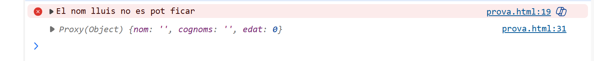

En canvi si agafem:

```javascript
const persona = {
  nom: "",
  cognoms: "",
  edat: 0,
};

const gestorProxy = {
  set(obj, prop, valor) {
    if (prop === "nom" && valor === "lluis") {
      console.error("El nom lluis no es pot ficar");
      return true; //  El return em surt competament de la funcio, per aixo no fa falta el else
    }
    obj[prop] = valor;
    return true;
  },
};

const persona1 = new Proxy(persona, gestorProxy);

persona1.nom = "alex";

console.log(persona1);
```

Surt

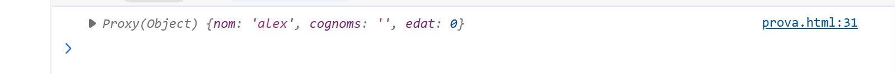

<br>

[☝️ retorn a l'ìndex](#javascript)

---

<div style="color:orange">

## Symbol

</div>

Els **Symbols** es fan servir quan es vol crear una propietat de un objecte que no es vulgui sobreescriurer mai.

Exemple:

```javascript
const persona = {
  nom: "Ismael",
  cognoms: "Figuera",
};

const idUnic = Symbol();

persona[idUnic] = 167;

console.log(persona);
```

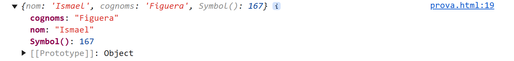

Com es pot veurer, surt el symbol que esta dintre de persona, el symbol no es pot modificar. Ara fem en una funcio:

```javascript
const persona = {
  nom: "Ismael",
  cognoms: "Figuera",
};

const salutacio = Symbol();

persona[salutacio] = function () {
  console.log("Hola, es una salutacio SYmbol");
};

console.log(persona);
```

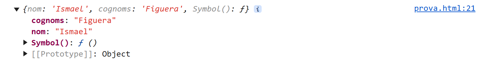

Com es pot veurer, al **Symbol** de persona hi ha una funcio, pero si la cridem surt...

```javascript
persona[salutacio]();
```

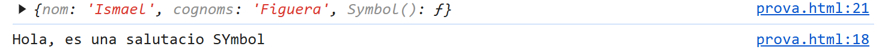

<br>

[☝️ retorn a l'ìndex](#javascript)

---

<div style="color:orange">

## Set

</div>

Els **Set** almacena tots els elements que vulguis, pero automatiacment elimina els duplicats.

Exemple:

Crem un set manualment i l'imprimim.

```javascript
const set = new Set([
  1,
  2,
  3,
  3,
  4,
  true,
  false,
  false,
  {},
  {},
  "hola",
  "hOla",
]);

console.log(set);
```

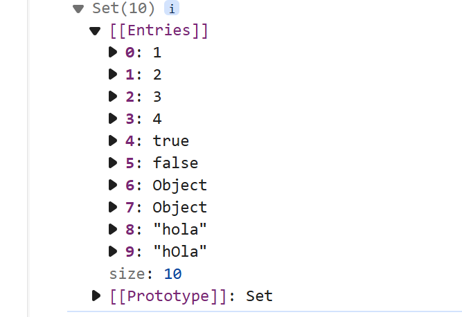

Com es veu, s'eliminen els repetits. Menys l'objecte perque els seus numeros de referencia son diferents.

### Weak Set

Els **_WeakSet_** solament poden almacenar objectes, els **_WeakSet_**, no es poden eliminar de cop ni iterar.

```javascript
const ws = new WeakSet();
let objectePersona = {
  nom: "Ismael",
  cognoms: "Figuera Farre",
  edst: 20,
};

let objectePersona1 = {
  nom: "Aissam",
  cognoms: "Bouazama",
  edat: 20,
};

ws.add(objectePersona);
ws.add(objectePersona1);

console.log(ws.has(objectePersona));

objectePersona = null;

console.log(ws.has(objectePersona));

console.log(ws.has(objectePersona1));
```

Com que no es pot iterar li preguntem amb un **has**, i eliminem lo de dintre amb el **null**.

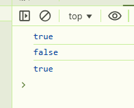

<br>

[☝️ retorn a l'ìndex](#javascript)

---

<div style="color:orange">

## Maps

</div>

El Mapes funcionen amb clau-valor
Aqui creem un mapa i l'imprimim.

```javascript
const mapa = new Map();
mapa.set("nom", "joan");
mapa.set("edat", 20);
console.log(mapa);
```

Aqui fem seris el **has**, el **get** i el **delete**.

El **has** comprova si la clau existeix al mapa.

El **get** retorna el valor de la clau.

I el **delete** l'esborra.

```javascript
console.log(mapa.has("nom"));
console.log(mapa.has("cognom"));
console.log(mapa.get("nom"));
mapa.delete("nom");
console.log(mapa);
```

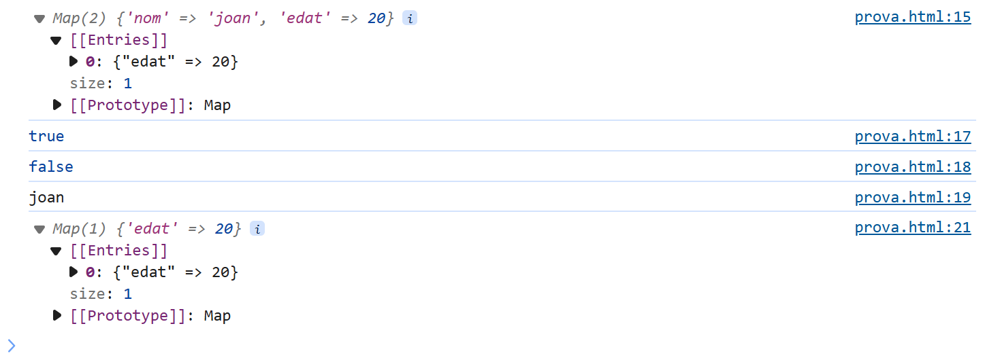

Ens imprimeix el mapa, comprova els has i ens retorna el get, despres en torna el mapa amb el **key** esborrat.

### Weak Map

El WeakMap es una coleccio que funciona amb claus-valor, tampoc es pot iterar.
Per a afegir s'utilitza el set, el get per a recuperar valors, el delete per esborrar i el has per comprobar si hi es.

```javascript
let wm = new WeakMap();

let objectePersona = {
  nom: "Ismael",
  cognoms: "Figuera Farre",
  edst: 20,
};

let objectePersona1 = {
  nom: "Aissam",
  cognoms: "Bouazama",
  edat: 20,
};

wm.set(objectePersona, "Ismael");
wm.set(objectePersona1, "Aissam");

console.log(wm.get(objectePersona));
console.log(wm.has(objectePersona));

wm.delete(objectePersona);

console.log(wm.has(objectePersona));
console.log(wm.has(objectePersona1));
console.log(wm.get(objectePersona1));
```

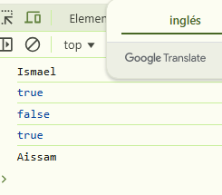

<br>

[☝️ retorn a l'ìndex](#javascript)

---

<div style="color:orange">

## JSON

</div>

En javascript es pot treballar amb **JSON**.

Creem l'onjecte amb dades almacenades.

Els metodes mes importants, son **Parse** i **stringify**.

El **JSON.stringify()** converteix un objecte JSON a string.

I el **JSON.parse()** converteix una cadena de text en un objecte JavaScript

```javascript
const json = {
  cadena: "Toni",
  numero: 33,
  boolea: true,
  array: ["gener", "febrer", "cantar"],
  objecte: {
    email: "nom@domini.com",
    twiter: "@nomimes",
  },
  null: null,
};

let cadena = JSON.stringify(json);

const javascript = JSON.parse(cadena);

console.log(cadena);

console.log(javascript);
```

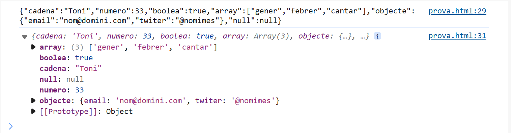

<br>

[☝️ retorn a l'ìndex](#javascript)

---

<div style="color:orange">

## Propietats dinamiques

</div>

Permet modificar les propietats de un objecte automaticament.

```javascript
let aleatori = Math.round(Math.random() * 100 + 5);

const objUsuari = {
  nom: "pepe",
  [`id_${aleatori}`]: "valor_aleatori",
};

console.log(objUsuari);

const usuaris = ["Toni", "Gemma", "Carlos", "Rosa"];

usuaris.forEach((ele, index) => {
  objUsuari[`id_${index}`] = ele;
});

console.log(objUsuari);
```

Es crea un aleatori i l'index de la propietat de l'objecte va canviant.

Despres es crea l'array usuaris i s'itera sobre ell, per cada element i l'index, s'afegeix una nova propietat a l'objecte.

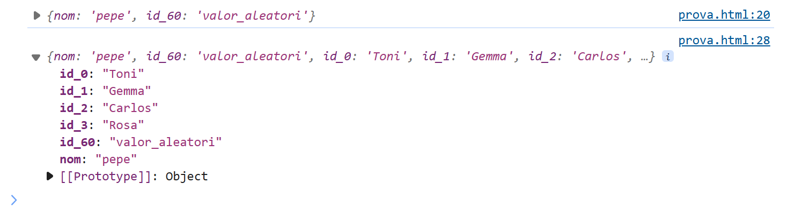

<br>

[☝️ retorn a l'ìndex](#javascript)

---

<div style="color:orange">

## This

</div>

### Funcions Anonimes

Aques es l'us del **this** en una funcio anonima.

```javascript
const objecte = {
  saludar: function () {
    console.log(`Hola desde una función anónima en un objeto ${this.nom}`);
  },
  nom: "Ismael",
};

objecte.saludar();
```

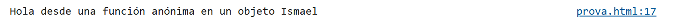

### Funcions Expressades

Aques es l'us del **this** en una funcio expressada.

```javascript
function saludar1() {
  console.log("Hola desde una funcio expressada");
  console.log(this);
}

saludar1();
```

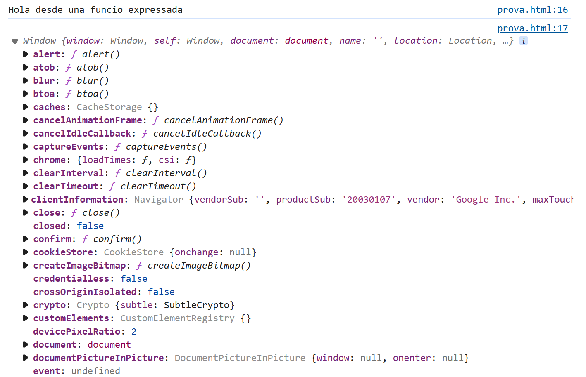

<br>

[☝️ retorn a l'ìndex](#javascript)

---

<div style="color:orange">

## Call - Apply - Blind

</div>

### Call

El call invoca una funcio i es passa els parametres indiviualment.

```javascript
function saludar(a) {
  console.log(`hola ${a} des de ${this.lloc}`);
}

const obj = {
  lloc: "Balaguer",
};

saludar.call(obj, "Ismael");
saludar.call(this, "Ismael");
saludar.call(null, "Ismael");
```

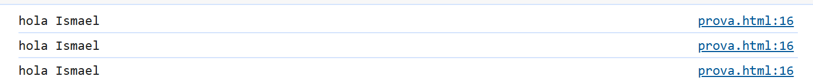

### Apply

El metode apply es similar al call, simplement els parametres de la funcio es passen com a array.

```javascript
function sumar(a, b) {
  return a + b;
}

const parametres = [10, 22];

const resultat = sumar.apply(null, parametres);
```

### Blind

Durant el blind se li passa el 1r parametre, despres se li passa el 2n.

```javascript
function sumar(a, b) {
  return a + b;
}

const resultat = sumar.bind(null, 13);

console.log(resultat(5));
console.log(resultat(20));
```

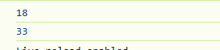

<br>

[☝️ retorn a l'ìndex](#javascript)

---